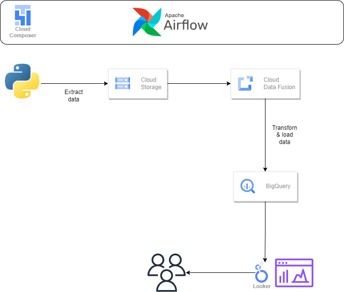

ETL Project with Data Fusion, Airflow, and BigQuery

This repository contains code and configuration files for an Extract, Transform, Load (ETL) project using Google Cloud Data Fusion for data extraction, Apache Airflow/Composer for orchestration, and Google BigQuery for data loading.

Problem Statement

It is tasked with creating a data pipeline to extract employee data from various sources, mask sensitive information within the data, and load it into BigQuery. Additionally, a dashboard must be developed to visualize employee data securely.

Requirements:

• Data Extraction: Extract employee data from multiple sources such as databases, CSV files, or APIs.

• Data masking: Identify sensitive information within the employee data, such as phone number numbers, address, and personal information.

• Data Loading into BigQuery: Design a process to securely load the extracted and masked employee data into Google BigQuery.

• Dashboard Visualization: Develop a web-based dashboard using visualization tools (e.g., Google Data Studio, Tableau, or ca dashboards).

Overview

The project aims to perform the following tasks:

Data Extraction: Extract data using python.

Data Masking: Apply data masking & encoding techniques to sensitive information in Cloud Data Fusion before loading it into BigQuery.

Data Loading: Load transformed data into Google BigQuery tables.

Orchestration: Automate complete Data pipeline using Airflow ( Cloud Composer )

Architecture

The architecture depicts an ETL (Extract, Transform, Load) data pipeline architecture using Google Cloud Composer, Apache Airflow, Cloud Data Fusion, Google BigQuery, and Looker for data visualization.

Key Components of the ETL Pipeline:

1. Data Extraction (Python):

-> The process begins by using a Python script to extract data from various sources such as databases, CSV files, or APIs.

-> This data is then temporarily stored in Google Cloud Storage for further processing.

2. Cloud Storage:

-> The extracted data is uploaded to Google Cloud Storage, acting as an intermediary storage point between the extraction phase and the transformation phase.

3. Cloud Data Fusion:

-> The data in Cloud Storage is ingested into Google Cloud Data Fusion for transformation.

-> Cloud Data Fusion performs data masking and transformation. It applies techniques such as masking sensitive information (e.g., social security numbers, salary data, personal contact details) to protect privacy before the data is loaded further down the pipeline.

4. Apache Airflow (Cloud Composer):

-> Apache Airflow, orchestrated by Cloud Composer, manages the entire ETL pipeline.

-> Airflow orchestrates the data flow from extraction (Python script), storage (Google Cloud Storage), and transformation (Cloud Data Fusion) to loading (BigQuery).

-> It automates and schedules these tasks, ensuring data flows smoothly between each step.

5. Data Loading (BigQuery):

-> After the data has been masked and transformed, it is loaded into Google BigQuery.

-> BigQuery acts as a cloud-based data warehouse, storing the transformed sales data.

6. Data Visualization (Looker):

-> The transformed data in BigQuery is then visualized using Looker.

-> Looker (or other dashboarding tools like Google Data Studio) provides a web-based dashboard for visualizing sales data securely, ensuring sensitive data remains protected while allowing authorized users to view insights.

Data Flow:

-> Python scripts extract the sales data and upload it to Google Cloud Storage.

-> Cloud Data Fusion takes the stored data, applies transformations and masking to sensitive information, and prepares it for secure storage.

-> Airflow orchestrates the flow between extraction, transformation, and loading processes.

-> The masked and transformed data is loaded into BigQuery for efficient querying and analysis.

-> Finally, Looker connects to BigQuery and provides visual insights into the sales data through customizable dashboards.